# Concordia Cart

An extension of the "shopping-cart" project by shashirajraja (https://github.com/shashirajraja/shopping-cart).

An e-commerce website for selling electronic products online.

Youtube video for introduction, demo and setup for this project: https://www.youtube.com/watch?v=RgQG0_orFpM

# About

In this project, a user can visit the website either as a guest or by registering and logging in.

They can check all the products available for shopping, filter and search items based on different categories, and then add to cart. They can add multiple items to the cart or increment or decrement the quantity while in the cart.

Once the cart is updated, the user can proceed to checkout and click the credit card payment details to proceed. Once the payment is successful, the orders will be placed and users will be able to see the order's details in the orders section along with the shipping status of the product.

The admin also plays an important role for this project as they are the one responsible for adding/ removing products, updating the items, and managing the inventory. The admin can see all the product orders placed and also can mark them as shipped or delivered based on the conditions.

One of this project's best functionalities is emailing customers.
Once a user registers, they will receive a success email. Whenever a user orders a product or the product got shipped from the store, the user will also receive a confirmation email.
If the user tries to order an item which is out of stock, they will get an email once the item is available again.

> [!NOTE]
> The payment page is for demo purposes only, so it's not fully integrated with any payment gateway. Any credit card details will be accepted and demo orders will be placed.

> [!WARNING]
> This is a sample project for learning purposes, so we have not considered security much.

# Highlights
The user will get an email when:
- They are newly registered
- An order is successfully placed
- The item was out of stock previously, but now it is available
- The product is successfully shipped and delivered

# Technologies Used

**Front-End Development**
- HTML
- CSS
- Javascript
- BootStrap

**Back-End Development**
- Java [JDK 8+]
- JDBC
- Servlet
- JSP

**Database**
- MySql

# Screenshots:
- Home Page
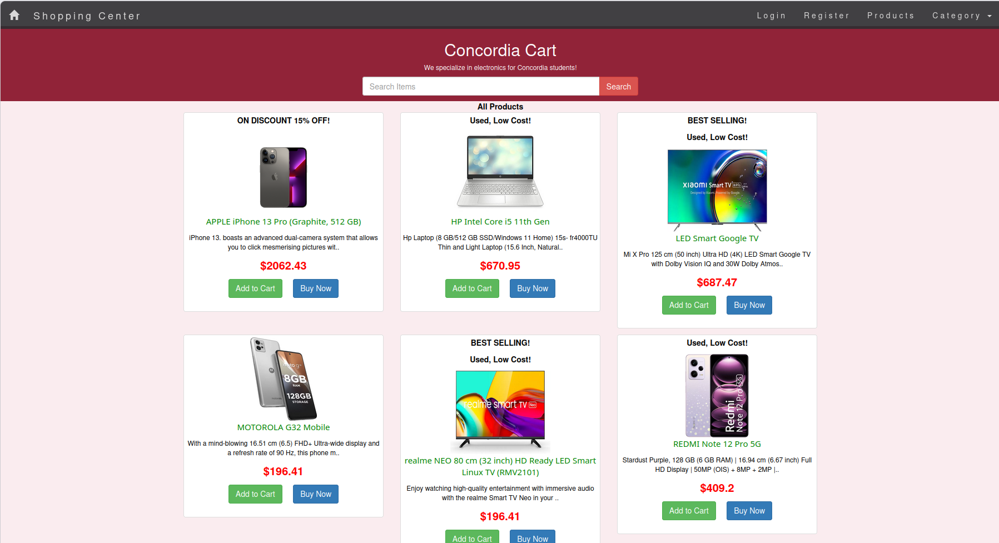

- Login Page
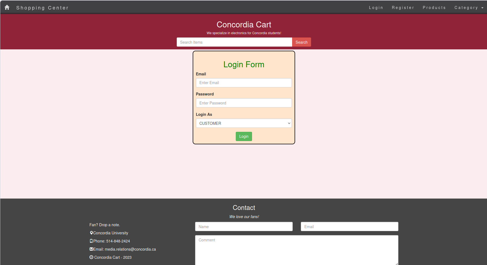

- Register Page
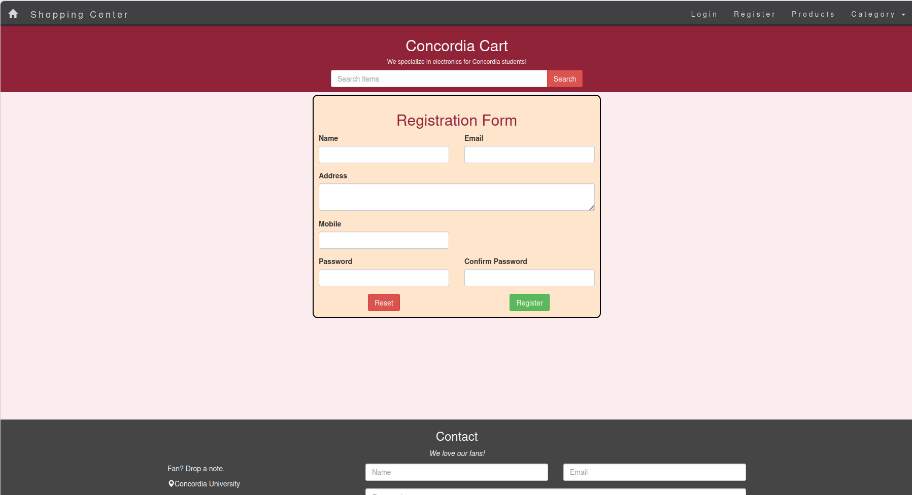

- Category Wise Product Filter
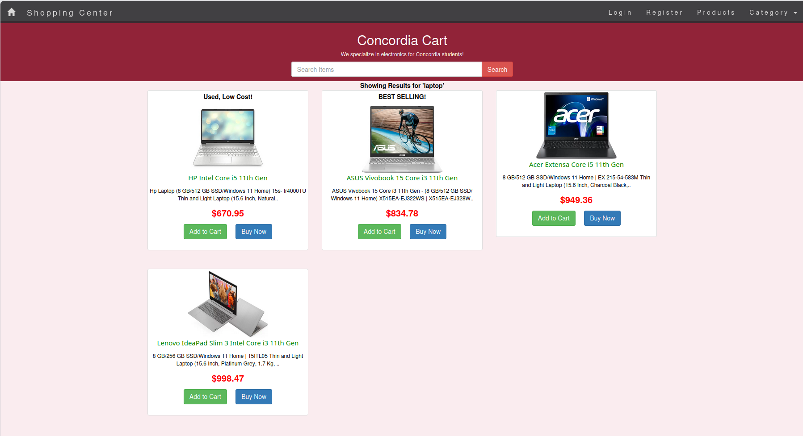

- Cart Items
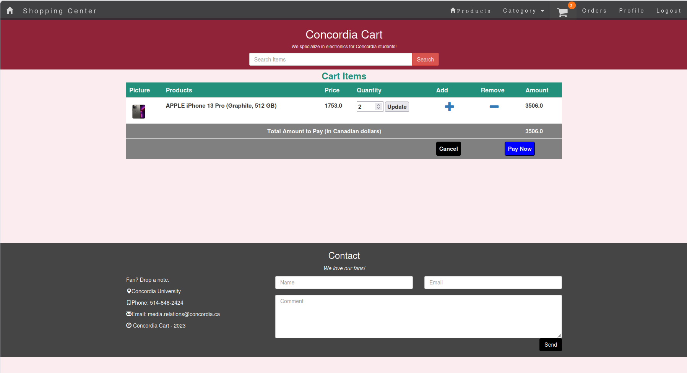

- Credit Card Payment
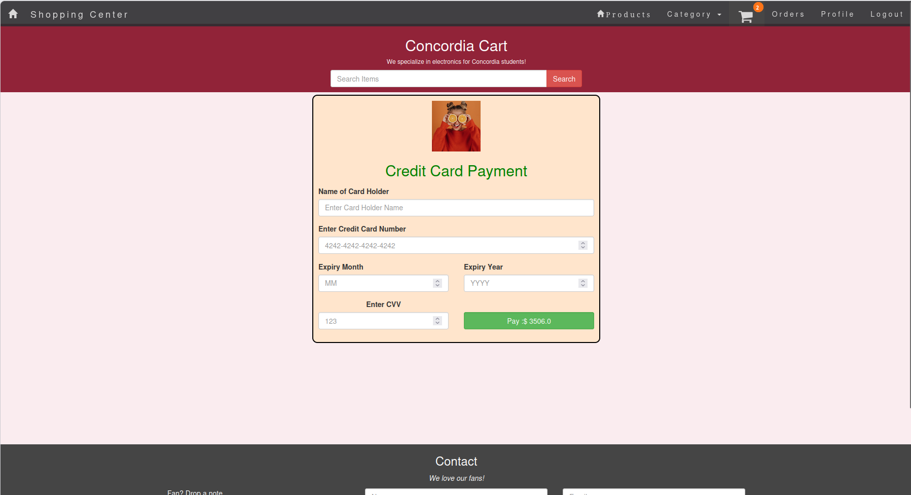

- Order Details & Status
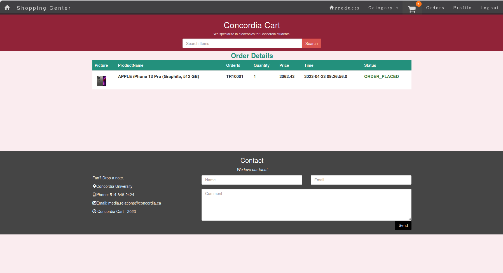

- User Profile
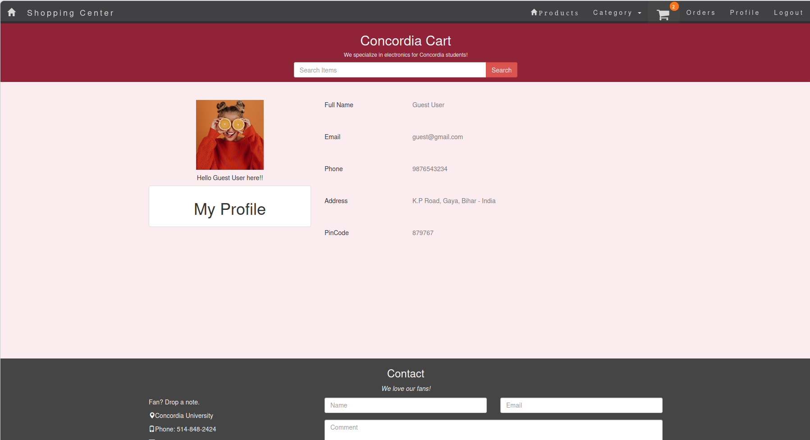

- Admin Home
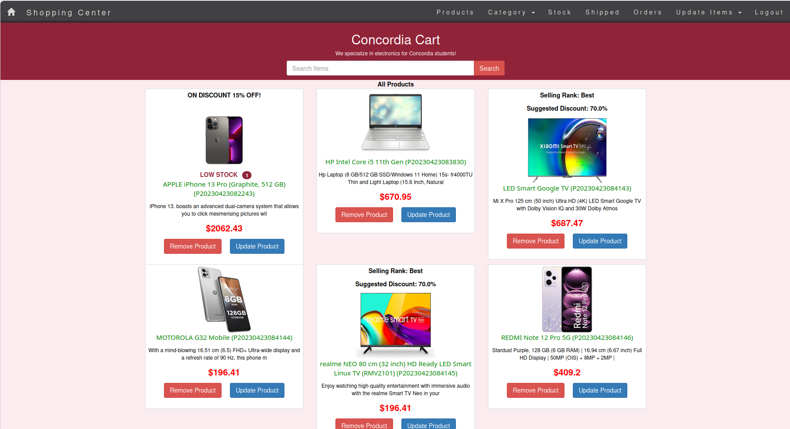

- Stock Items
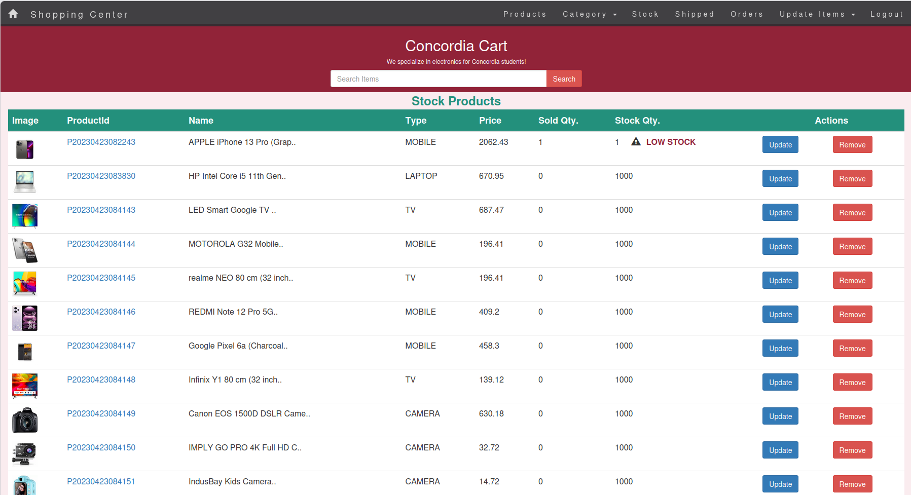

- Shipped Items
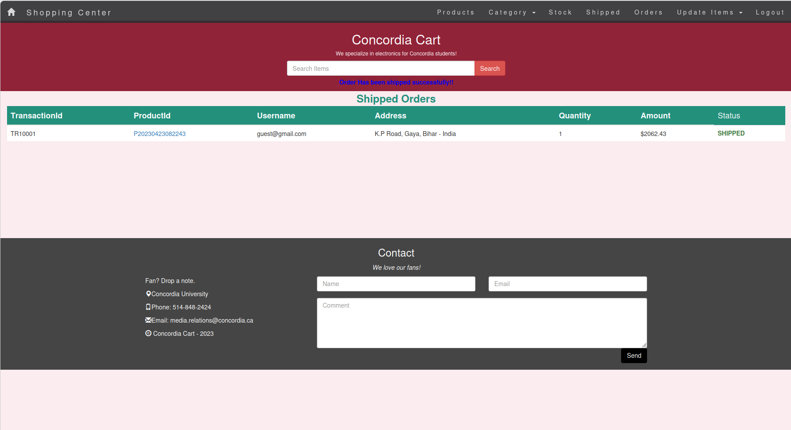

- Recent Orders yet to be shipped
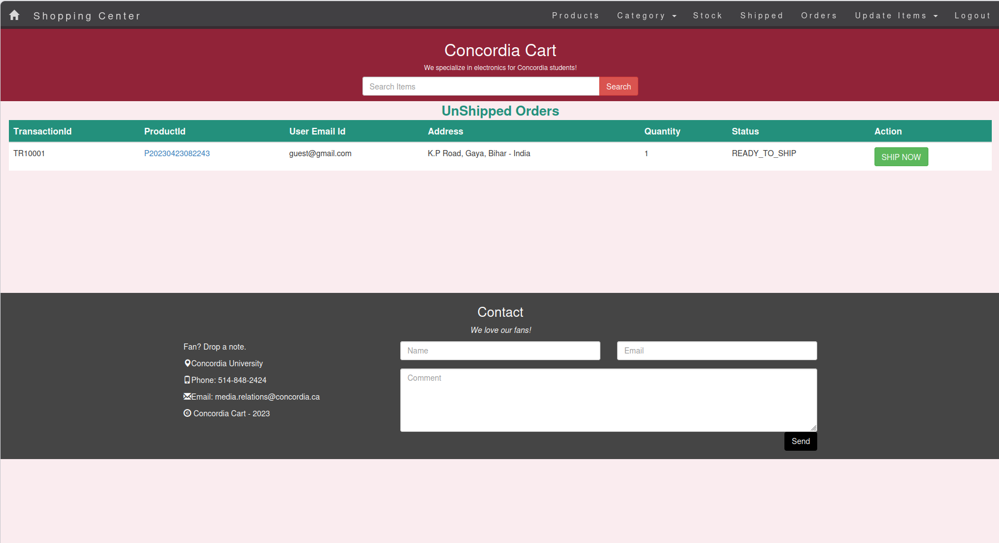

- Add Product to the stock
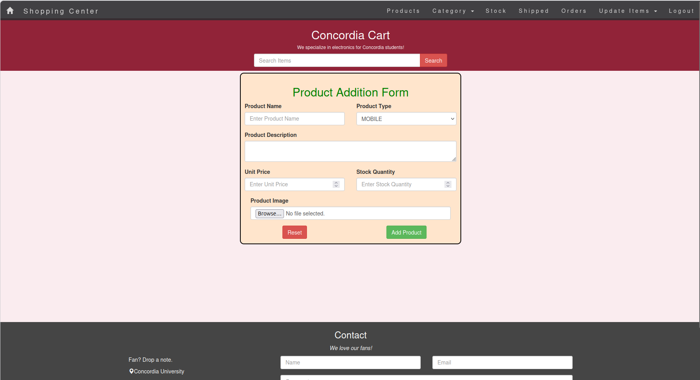

- Remove Product from the stock
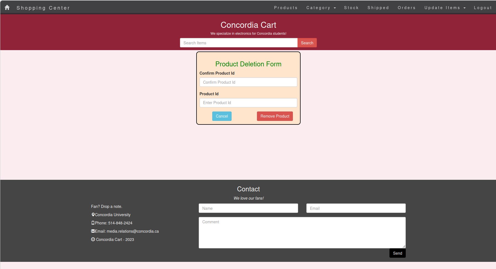

- Update the stock item
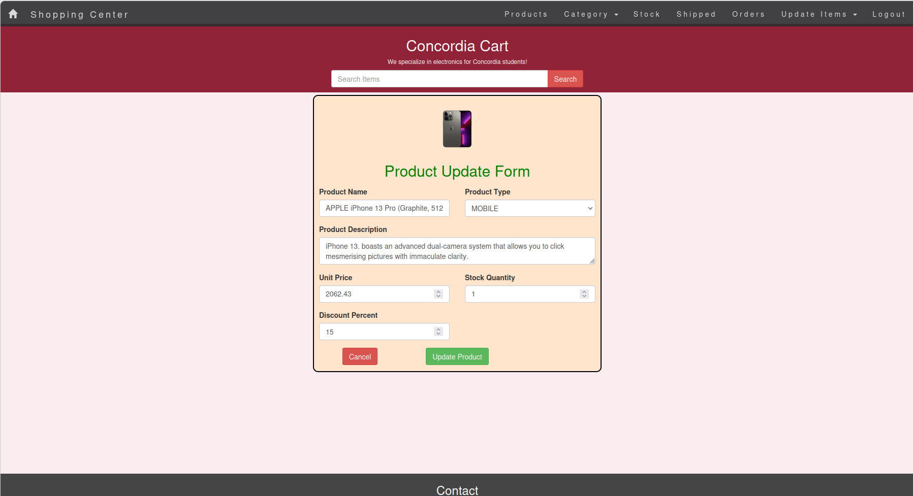

- Sample Email for order placed

## Class Diagram

